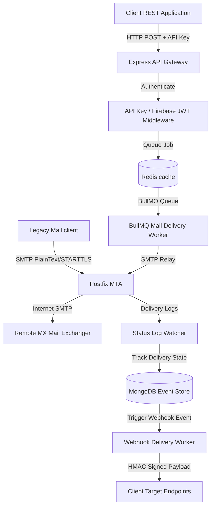

# GhostSMTP System Architecture

GhostSMTP is a production-grade transactional email service built with multi-tenant isolation, structured event-store tracking, and a resilient queue delivery infrastructure.

## System Topology Overview



## Directory Structure

```
ghostsmtp/
├── client/                     # React Frontend Single Page Application
│   ├── src/
│   │   ├── api/                # API client base & Firebase configurations
│   │   ├── components/         # Shared layouts and component assets
│   │   ├── context/            # Auth and Workspace Context state trees
│   │   └── pages/              # Dashboard pages (Domains, Webhooks, API keys)
│   ├── tsconfig.json           # Compiler typings configuration
│   └── vite.config.ts          # Vite asset pipeline & local reverse proxy
│
├── server/                     # Node.js + Express API Backend Server
│   ├── src/
│   │   ├── config/             # Environment, DB, & Redis connections configs
│   │   ├── controllers/        # Express handlers (Domains, API keys, Webhooks)
│   │   ├── middleware/         # Auth, Tenant Isolation, & error boundaries
│   │   ├── models/             # MongoDB schemas & index specifications
│   │   ├── repositories/       # Abstraction layers isolating database queries
│   │   ├── routes/             # REST route registration endpoints
│   │   └── services/           # Business logic engines (SMTP send, Webhooks dispatch)
│   └── tsconfig.json           # Backend compiler type configs
│
└── docker/                     # Infrastructure configurations
    ├── mail/                   # Postfix, Dovecot, OpenDKIM, OpenDMARC setups
    └── nginx/                  # Reverse proxy configs forwarding to backend/frontend
```

## Backend Architecture & SOLID Principles

The backend utilizes **Clean Architecture** patterns:
* **Controller Layer**: Sanitizes input parameters using validation schemas (e.g. `zod`) and routes req/res lifecycle.
* **Service Layer**: Coordinates business workflows (MIME generation, SMTP relays, webhook signature hashing).
* **Repository Layer**: Encapsulates all direct database query operations (Mongoose models interactions), implementing the Repository Pattern cleanly.
* **Database Models Layer**: Standardizes schemas definitions, indexes, and schemas relations.

## Data Transmission Workflows

### 1. SMTP Sending Pipeline
1. Client requests a message send via `POST /api/v1/emails/send` with their API Key, or relays via Postfix using custom SMTP Credentials.
2. The server verifies credentials validity and enqueues a job payload onto Redis via BullMQ.
3. The Mail Worker picks up the job, retrieves DNS settings for the verified sender domain, assembles a MIME message body (supporting HTML, plain text, custom headers, and attachments), and relays it to Postfix.
4. Postfix transmits the email to the destination remote MX server.

### 2. Queue & Worker Lifecycles
* **BullMQ Queue**: Handles high-concurrency requests securely using Redis-backed transactional queues.
* **Worker Threads**: Pick up jobs, implement retry policies, trace timeouts, and move failing messages to the **Dead Letter Queue (DLQ)**.

### 3. Webhooks Callback Engine
1. Outbound delivery status triggers a `DeliveryEvent` (e.g., delivered, bounced, complained).
2. The database updates the email log record and dispatches a task to the Webhook Queue.
3. The Webhook worker computes an `HMAC-SHA256` signature using the webhook endpoint's registered secret and forwards the payload via POST, handling timeout limits and exponential backoff retry.
