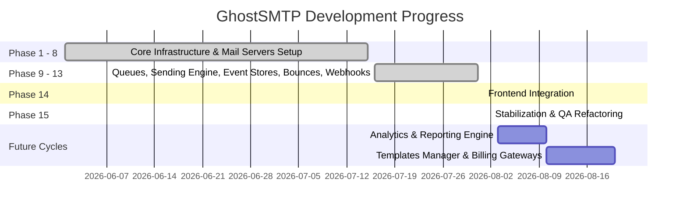

# GhostSMTP Version Roadmap

This document outlines the completed work, upcoming development cycles, production release milestones, and future feature items.

## Development Progress

---

## Phase Milestones Registry

### Completed Phases (1 - 14)
* **Phase 1-8**: Initialized multi-container orchestration. Constructed Postfix, Dovecot, OpenDKIM, OpenDMARC, Rspamd, Nginx configuration templates, and mapped database structures.
* **Phase 9**: Created BullMQ queue structures, Workers engine, retry policies, and Dead Letter Queue (DLQ).
* **Phase 10**: Built transactional email sending engine API (`/emails/send`), SMTP submission pipeline, validation validators, and MIME body parsing.
* **Phase 11**: Implemented delivery logs tracking database collections, Event Store transitions records, and MX servers SMTP codes checks.
* **Phase 12**: Automated hard/soft bounce and complaint events parser, registering suppression lists dynamically.
* **Phase 13**: Established HMAC-signed webhook callback triggers, rotating secrets endpoints, retry policies, and network test triggers.
* **Phase 14**: Connected dashboard UI pages (Vite + React) to APIs, implementing Firebase Auth, JWT validation, workspace onboarding, and audit logs.

### Active Phase (15)
* **Stabilization & Documentation**: Restructured TypeScript compiler configs, cleaned unused imports, verified Docker compose setups, and compiled documentation manuals.

---

## Production Release Checklist

- [ ] Connect production Firebase Auth parameters.
- [ ] Configure Let's Encrypt SSL certificates inside Nginx configuration directories.
- [ ] Setup production spam scanner rules in Rspamd controller console.
- [ ] Configure Postfix limits policies (rate limit outgoing relays, maximum attachments sizes).
- [ ] Enable rate-limiting middleware for HTTP endpoints to protect Express services.
- [ ] Connect production logs monitor alerts.

---

## Future Feature Improvements

1. **Detailed Analytics Engine**:
   * Build aggregations to chart send volume, success delivery rate, bounce/complaint rates.
2. **Dynamic HTML Templates Manager**:
   * Establish drag-and-drop builder, templates version history, and mail merge variables compilation.
3. **Advanced Webhooks Filtering**:
   * Enable users to subscribe to specific events individually or set custom callback headers.
4. **Billing & Subscriptions Gateway**:
   * Integrate Stripe, limit active workspace quota volumes based on plans.
